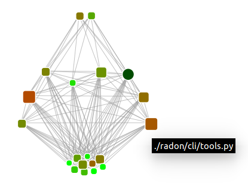

=======
CodeInk
=======
.. image:: https://img.shields.io/badge/license-Apache%202.0-blue.svg
    :alt: LICENSE
    :target: LICENSE
    
.. image:: https://travis-ci.org/carocad/CodeInk.svg?branch=master
    :target: https://travis-ci.org/carocad/CodeInk

.. image:: https://coveralls.io/repos/carocad/CodeInk/badge.svg?branch=master
  :target: https://coveralls.io/r/carocad/CodeInk?branch=master
  
.. image:: https://codeclimate.com/github/carocad/CodeInk/badges/gpa.svg
   :target: https://codeclimate.com/github/carocad/CodeInk
   :alt: Code Climate

CodeInk is a Python source code analyzer focused on complexity and interrelation of modules.

CodeInk draws the ihnerent relations of your modules along with their complexity and
maintanability indexes in a beautiful graph powered by D3.js.

- drawing of radon v1.2
- hover over a rounded rectangle to check which module is it

o.O?
----

the animations that CodeInk creates are base on:

* symbols: ``squares = modules``, ``circle = Python``, ``cross = target module``, ``class = diamond``, ``function = triangle-up``, ``method = triangle-down``
* lines: each line represents an import
* color: module maintainability index ``green = :)`` --> ``red = :(``
* size: ciclomatic complexity ``small = :)`` --> ``big = :(``

*hint: if A imports B, and B imports C, then A imports B and C, right?*
A --> B, B --> C, A --> B & C

install
=======
with pip::

    pip3 install git+https://github.com/carocad/CodeInk.git
    
manually::

    git clone https://github.com/carocad/CodeInk.git
    python3 setup.py install

usage
=====

draw a package structure::

    codeink draw /path/to/project

trace a module's imports::

    codeink trace /path/to/module.py

check who imports a module::

    codeink blame /path/to/module.py

get an overview of a module::

    codeink portrait /path/to/module.py

requirements
============
* python v2.6 - v3.4
* `docopt v0.6.2 <https://pypi.python.org/pypi/docopt>`_
* `networkx v1.9.1 <https://pypi.python.org/pypi/networkx/1.9.1>`_
* `radon v1.2 <https://pypi.python.org/pypi/radon/1.2.1>`_
* `astunparse v1.2 <https://pypi.python.org/pypi/astunparse/1.2.2>`_
* `D3.js <http://d3js.org>`_ (used automatically in the html head)

notes
=====
In order to use CodeInk you must make sure that your python version uses the same syntax as the code that you are analyzing i.e. analyzing a code written with Python v2.7 syntax while using Python v3.x will result in an error.

